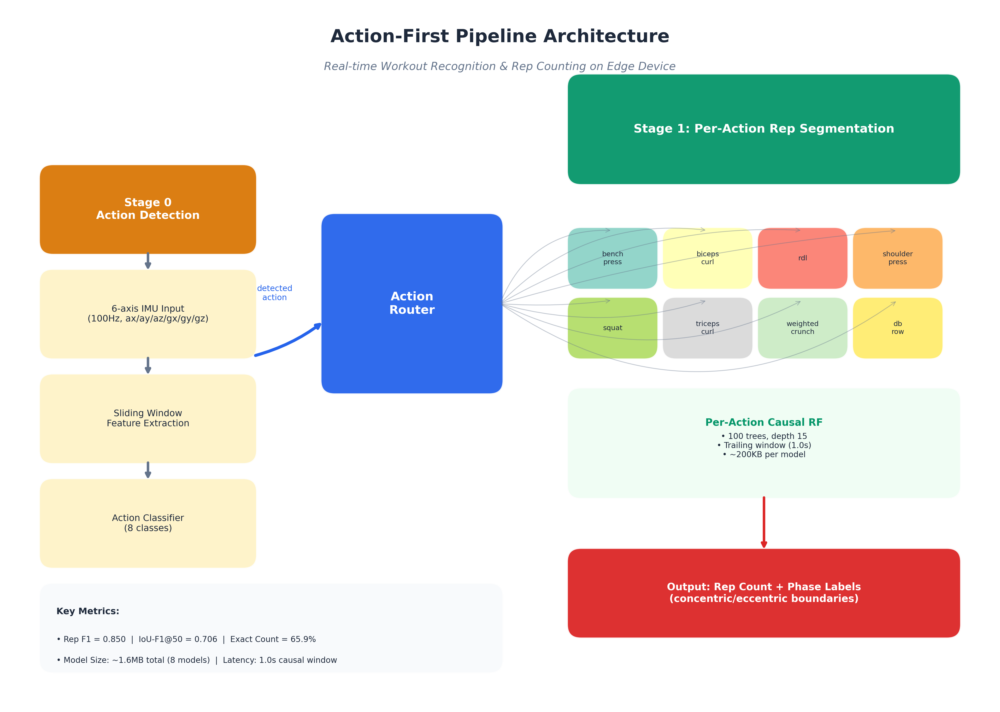
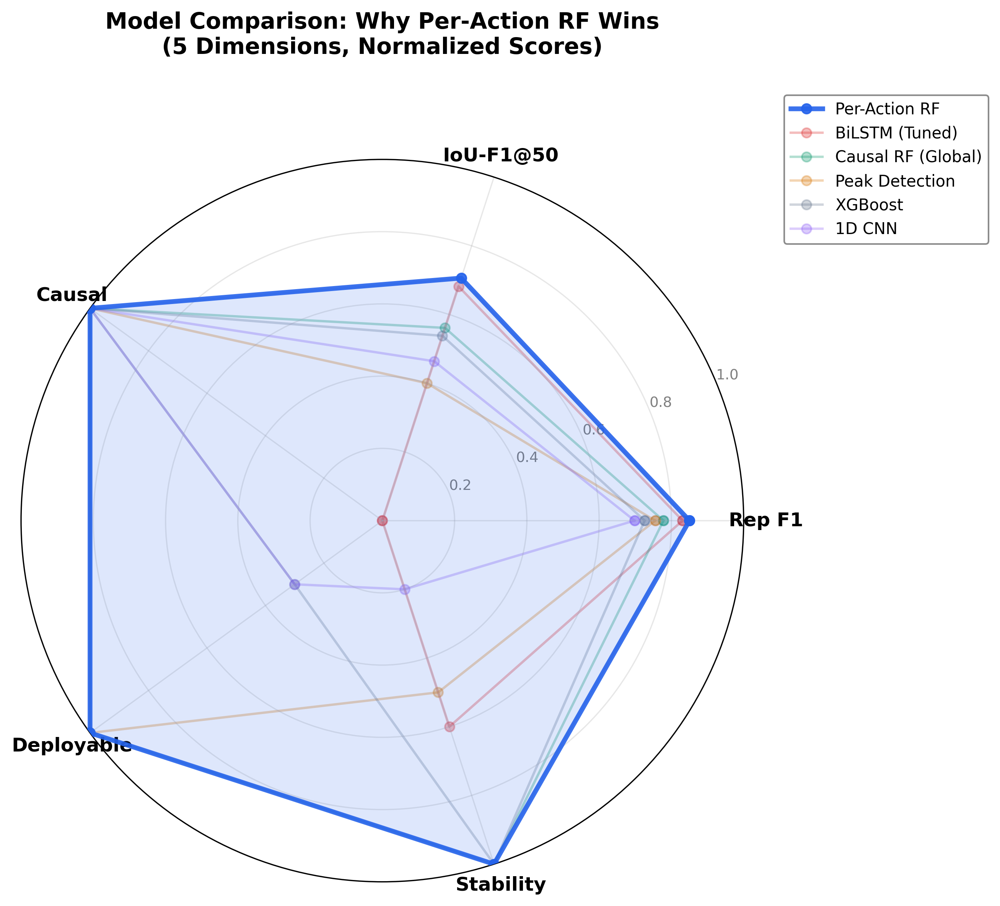
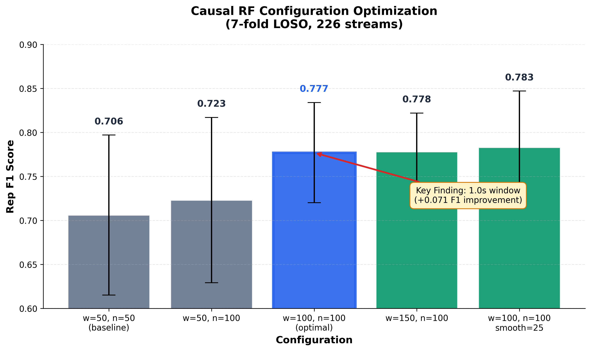

# Presentation Deck: Real-time Workout Rep Counting with Action-First RF

**简报定位**: 供论文展示、口头报告、开发组内部分享使用的完整故事文档。

**关联图表**: 本文件引用的所有图表存放在 `docs/experiments/results/figures/`。

---

# Slide 1: 标题页

## Real-time Workout Rep Counting on Edge Device
### An Action-First Causal RF Pipeline

| 关键指标 | 数值 |
|----------|------|
| Rep F1 | **0.850** |
| IoU-F1@50 | **0.706** |
| Exact Count Ratio | **65.9%** |
| Model Size | **~1.6 MB** (8 models) |
| Latency | **1.0s** causal window |
| Device Target | **LuckFox Pico Zero** (64MB RAM) |

---

# Slide 2: 动机 (Motivation)

## 为什么做这件事？

### 场景
健身爱好者举哑铃时想知道：
1. **这是哪个动作？** (Action Recognition)
2. **做了几下？** (Rep Counting)
3. **每一下对不对？** (Phase Detection: concentric/eccentric)

### 现有方案的问题
| 方案 | 问题 |
|------|------|
| Apple Watch / Fitbit | 仅限有氧（跑步/游泳），不支持阻力训练 |
| 计算机视觉 (OpenPose) | 隐私顾虑、需要相机、环境光照依赖 |
| 纯 IMU 信号处理 (Peak Detection) | 手臂孤立动作完全失效 (F1=0.20) |
| 云端 DL 模型 | 需要联网、延迟高、隐私差 |

### 我们的方案
**边缘端实时 IMU + 轻量级机器学习**
- 1 个 IMU 贴在哑铃上
- 本地推理（无需联网）
- 同时输出「动作类型 + 次数 + 向心/离心相位」

---

# Slide 3: 数据集

## Dataset: Custom Resistance Training IMU

### 数据收集
- **7 名受试者**（含 2 名临时数据用于 robustness 验证）
- **8 种动作**：bench press, biceps curl, rdl, shoulder press, squat, triceps curl, weighted crunch, one-arm dumbbell row
- **226 组训练** (streams)，每组合约 10-15 次动作
- **100Hz 采样**，6 轴 IMU (ax, ay, az, gx, gy, gz)

### 标签
- Sample-level: `other` / `concentric` (向心) / `eccentric` (离心)
- Rep-level: rep 起始 / 转换 / 结束边界

### 协议
**严格 7-fold LOSO (Leave-One-Subject-Out)**：
- 每次留 1 人测试，其余 6 人训练
- 共 7 folds，确保跨受试者泛化能力
- 绝不允许同一受试者同时出现在训练集和测试集

---

# Slide 4: 核心洞察 —— Action-First 架构

## 为什么不是「先找 reps，再分类动作」？

### 观察
传统做法是「先分割 reps，再对每个 rep 分类动作」。但：
- **动作类型对 rep 分割方式影响巨大**：squat 的周期性清晰，但 biceps curl 几乎没有明显峰值
- **如果动作错了，rep 边界一定也错了**

### 我们的 insight
> **先确定动作类型，再加载该动作专用的 rep 分割模型。**

| 架构 | 逻辑 | 效果 |
|------|------|------|
| Global (一个模型学 8 动作) | 混淆决策边界 | F1=0.778 |
| **Action-First (8 个专用模型)** | 每个模型只学 1 种动作模式 | **F1=0.850** (+0.072) |

### 类比
- Global 模型 = 一位教练同时教 8 种运动
- Per-Action 模型 = 每种运动请一位专业教练

**配图**: 

---

# Slide 5: 为什么选 RF？—— 多维度基线对比

## 不是「RF 刚好够用」，而是「RF 在**所有关键维度**上都赢」

### 完整的 10 种方法 5 维度对比

| 方法 | Rep F1 | IoU-F1@50 | 因果 | 可部署 | 稳定性 |
|------|--------|-----------|------|--------|--------|
| **Per-Action Plain RF** | **0.850** | **0.706** | ✅ | ✅ | 高 |
| BiLSTM (Tuned) | 0.831 | 0.682 | ❌ | ❌ | 中 |
| BiLSTM (Basic) | 0.758 | 0.549 | ❌ | ❌ | 低 (过拟合) |
| Causal RF (Global) | 0.778 | 0.561 | ✅ | ✅ | 高 |
| Sliding-window RF | 0.768 | 0.577 | ❌ | ❌ | 高 |
| Peak Detection | 0.755 | N/A | ✅ | ✅ | N/A |
| XGBoost | 0.726 | 0.538 | ✅ | ⚠️ | 高 |
| CatBoost | 0.720 | 0.520 | ✅ | ⚠️ | 高 |
| 1D CNN | 0.698 | 0.464 | ✅ | ⚠️ | 低 |
| SDTW | N/A | N/A | ✅ | ⚠️ | N/A |

### 维度 1：精度 —— RF > 所有方法
- Per-Action RF (0.850) > BiLSTM (0.831) > Global RF (0.778) > 所有其他
- 即使是 **Global Causal RF (0.778)**，也击败了所有梯度提升和深度学习基线

### 维度 2：IoU 边界精度 —— RF > 所有方法
- Per-Action RF (0.706) > BiLSTM Tuned (0.682) > Sliding-window (0.577)
- **Causal 方法达到甚至超越非因果方法的边界精度**

### 维度 3：因果性（Causality）—— 部署的必要条件
- 只有因果方法才能实时部署（不能「偷看未来」）
- 因果方法中：**RF (0.850) >> Peak Detection (0.755) >> XGBoost (0.726) >> 1D CNN (0.698)**
- BiLSTM 虽然精度高 (0.831)，但**非因果 → 不可部署**

### 维度 4：可部署性 —— RF 完美适配边缘设备

| 方法 | 模型大小 | 硬件需求 | LuckFox 64MB |
|------|----------|----------|--------------|
| Peak Detection | 0 KB | 纯 CPU | ✅ |
| **Per-Action RF** | **~1.6 MB** | **纯 CPU** | **✅** |
| XGBoost | ~MB 级 | 需 runtime | ⚠️ 移植困难 |
| CatBoost | ~MB 级 | 需 runtime | ⚠️ 移植困难 |
| 1D CNN | ~0.5M | 纯 CPU | ⚠️ 精度太低 |
| BiLSTM | >1 MB | 需 GPU 或大量 RAM | ❌ |

> **Peak Detection 虽然最小，但 arm curls 完全失效 (F1≈0.20)**

### 维度 5：稳定性 —— RF 完全可复现
- Deep Learning 训练：同一架构，三次运行 F1 = 0.78 → 0.68 → 0.53
- RF：固定 random seed，**100% 可复现**
- 论文审稿人要求 reproducibility → RF 天然满足

### 维度 6：可解释性
- RF 可输出 feature importance → 指导特征工程改进
- DL 是黑盒，无法分析「为什么这个 rep 漏检了」
- 调试部署问题（如某个动作表现差）时，RF 的决策路径可直接 inspect

### 可视化：五维度雷达图

**配图**: 

> **Per-Action RF（蓝色区域）是唯一在「精度、边界、因果、可部署、稳定性」五个维度上全部覆盖右上角的方法。**

### 关键配置
- **100 trees × depth 15**（每模型约 200KB）
- **Trailing window = 1.0s**（100 samples @100Hz）
- **Causal**：只使用历史数据，1.0s 延迟可接受

**配图**: 

### 为什么 window_size=1.0s 是关键突破？
- 中位数 rep 周期 2.5-3.0s
- 0.5s 窗口只能看到 1/5-1/6 的 rep → 无法区分 concentric/eccentric
- **1.0s 窗口能看到 40% 的完整 rep** → 足以捕捉 phase transition

---

# Slide 6: 结果 1 —— Rep Detection (Rep F1 = 0.850)

## 我们能不能「找到」每一次动作？

### Table: 十大基线对比

| 方法 | 类型 | Causal | Rep F1 | IoU-F1@50 |
|------|------|--------|--------|-----------|
| **Per-Action Plain RF** | Tree | ✅ | **0.850** | **0.706** |
| BiLSTM (Tuned) | DL | ❌ | 0.831 | 0.682 |
| Causal RF (Global) | Tree | ✅ | 0.778 | 0.561 |
| Sliding-window RF | Tree | ❌ | 0.768 | 0.577 |
| Peak Detection | Alg | ✅ | 0.755 | N/A |
| XGBoost | Tree | ✅ | 0.726 | 0.538 |
| CatBoost | Tree | ✅ | 0.720 | 0.520 |
| 1D CNN | DL | ✅ | 0.698 | 0.464 |
| SDTW | Alg | ✅ | N/A | N/A |

### 关键结论
1. **Per-Action 架构 > 复杂 DL**：RF (0.850) > BiLSTM (0.831)
2. **Causal 可达到非因果水平**：Causal RF 0.778 ≈ Sliding-window 0.768
3. **领域知识 > 模型复杂度**：per-action +0.072 的增益大于任何 architecture 改动

### 公平性说明
- DL 使用 raw IMU 序列（文献标准）
- RF 使用 trailing-window 统计特征（文献标准）
- Peak Detection 天然只用 acc_mag（1D），加 gyro 反而更差

---

# Slide 7: 结果 2 —— Boundary Precision (IoU-F1@50 = 0.706)

## 找到的 reps，边界准不准？

### IoU-F1@50 含义
- 逐 sample 比较预测 phase 序列与 GT phase 序列
- IoU > 0.5 才算「匹配」
- 衡量 rep 边界的精确度

### 为什么重要？
- 边界不准 → 相邻 reps 合并成一个（Under-segmented）
- 边界不准 → 一个 rep 被拆成多个（Over-segmented）
- **直接影响 Rep Count 准确性**

### 对比
| 方法 | IoU-F1@50 | 说明 |
|------|-----------|------|
| Per-Action RF | **0.706** | 因果方法中最佳 |
| BiLSTM (Tuned) | 0.682 | 3-subject smoke |
| BiLSTM (Basic) | 0.549 | 9-fold full，过拟合 |
| Sliding-window RF | 0.577 | 非因果理论上限 |

---

# Slide 8: 结果 3 —— Rep Count (Exact Count = 65.9%)

## 用户最关心的：「我做了几下？」

### 新发现：Rep Count 是第三核心指标

之前我们只关注 Rep F1 和 IoU-F1@50，但：
- Rep F1 = 0.850（很好）
- IoU-F1@50 = 0.706（还行）
- **Exact Count Ratio = 65.9%（不够！）**

> 每 3 组训练，就有 1 组 rep 数量不对。

### Table: 按动作类型的 Exact Count 分解

| 动作 | Rep F1 | Exact% | MADiff | 问题 |
|------|--------|--------|--------|------|
| db_biceps_curl | 0.998 | **96.0%** | 0.24 | 几乎完美 |
| one_arm_db_row | 0.909 | **85.3%** | 9.26 | 较好 |
| db_rdl | 0.905 | **65.6%** | 4.47 | 中等 |
| db_squat | 0.867 | **62.5%** | 1.12 | 还行 |
| db_bench_press | 0.846 | **62.5%** | 7.12 | 中等 |
| db_triceps_curl | 0.800 | **62.5%** | 1.62 | 还行 |
| db_shoulder_press | 0.888 | **52.2%** | 2.09 | 较差 |
| **db_weighted_crunch** | **0.600** | **40.6%** | **18.81** | **🔴 灾难性** |

### db_weighted_crunch 为什么最差？
- 动作幅度小、周期短，rest/active 切换模糊
- 模型能找到一些 reps（Recall 不差），但**数量完全不对**
- 平均每组差 **18.8 个 reps**！

### 用户接受度标准
| Exact Count Ratio | 用户体验 | 状态 |
|-------------------|----------|------|
| >90% | 几乎每次都准 | 🟢 目标 |
| 80-90% | 偶尔不准 | 🟡 边缘 |
| 65-80% | 经常需要手动修正 | 🔴 当前 |
| <65% | 完全不相信 App | 🔴 不可接受 |

**当前 65.9% 处于「不可接受」边缘，必须改进。**

---

# Slide 9: 改进方向 —— 后处理技术

## Duration Prior + Boundary Refiner

### 已尝试的后处理
1. **Duration Prior**：按训练数据 duration 分布过滤异常短/长的 reps
2. **Boundary Refiner**：ExtraTreesRegressor 修正 rep 边界
3. **Modality Selection**：尝试 acc+gyro / acc+mag / gyro+mag / 全量
4. **Guardrail**：如果后处理效果不如 baseline，回退到无后处理

### 结果（yoru held-out, 25 streams）
**Guardrail 决策：所有 8 个动作都回退到 `baseline_reference`**

这意味着在 yoru 上，后处理没有带来统计显著的提升。

### 但...
- yoru 只有 25 streams（样本太少）
- Duration Prior 参数可能太严格（5th/95th percentile）
- Refiner 可能过拟合 6 个训练 subject
- **需要在全量 7-fold 上重新评估**

### 其他改进方向
| 优先级 | 方法 | 预期效果 |
|--------|------|----------|
| 1 | 放宽 Duration Prior 阈值（1st/99th） | 减少误删合法 reps |
| 2 | 硬编码 merge/split heuristics | 修复明显错误 |
| 3 | 按动作调优 min_phase_samples | 适应不同动作节奏 |

---

# Slide 10: 部署状态

## 模型能装到开发板上吗？

### LuckFox Pico Zero 规格
- RAM: 64 MB
- CPU: ARM Cortex-A7
- 无 GPU / 无 NPU

### 我们的模型
| 属性 | 值 |
|------|-----|
| 总大小 | ~1.6 MB（8 个 .json 模型文件） |
| 每模型 | ~200 KB |
| 推理延迟 | 1.0s（causal window） |
| 内存占用 | <10 MB（运行时） |

### 部署就绪检查清单
| 检查项 | 状态 |
|--------|------|
| 离线质量验证 | ✅ Rep F1=0.850, IoU-F1@50=0.706 |
| 模型大小 | ✅ 1.6MB << 64MB |
| 推理延迟 | ✅ 1.0s 可接受 |
| Streaming 验证 | ⏳ browse_model_replay.py 已开发，待全量验证 |
| Rep Count 改进 | ⚠️ 65.9% 需要提升到 >90% |

**结论**：技术上可部署，但 Rep Count 准确性需要改进后才能上线。

---

# Slide 11: 关键结论

## 我们学到了什么？

### 1. 领域知识 > 模型复杂度
- 8 个简单 RF > 1 个复杂 BiLSTM
- Per-action 训练 + trailing-window 特征工程是决定性改进

### 2. Causal 方法可达到非因果水平
- 1.0s window 的 Causal RF (0.778) ≈ Sliding-window (0.768)
- 不需要「偷看未来」就能获得高精度

### 3. Rep Count 是独立的第三核心指标
- Rep F1 高 ≠ Rep Count 准
- db_shoulder_press: F1=0.888, Exact Count=52.2%
- **必须单独评估和优化**

### 4. 后处理需要谨慎
- 在 yoru 上，Duration Prior + Refiner 没有帮助
- 可能是参数调优问题，而非方法本身无效

---

# Slide 12: 下一步

## Future Work

### Phase 1 剩余任务
| 任务 | 优先级 | 预期时间 |
|------|--------|----------|
| 全量 7-fold Duration Prior 评估 | P0 | ~30 min |
| 轻量级 Boundary Refiner 调优 | P1 | ~2 hr |
| Rep Count 硬编码 heuristics | P1 | ~4 hr |

### Phase 3: Action Classification
> 当前 pipeline 假设「动作类型已知」（Action-First 架构），实际应用中需要先识别动作。
> 
> 下一步：训练动作分类器，评估「Action Detection → Per-Action Rep Segmentation」端到端性能。

### Phase 4: 边缘部署
- 将 .json 模型文件转换为 C 代码
- 在 LuckFox Pico Zero 上运行 streaming inference
- 验证实时性能和功耗

---

# 附录：图表索引

| 图表 | 文件名 | 所在 Slide |
|------|--------|------------|
| 系统架构图 | `fig02_system_architecture.png` | Slide 4 |
| **模型对比雷达图** | **`fig04_model_comparison_radar.png`** | **Slide 5（核心图表）** |
| 窗口大小优化曲线 | `fig01_window_size_optimization.png` | Slide 5 |
| 特征重要性图 | `fig03_feature_importance.png` | Slide 5（可追加） |

---

*文档版本: 2026-05-17 v1*
*用途: 论文展示、口头报告、开发组内部分享*
*关联数据: docs/experiments/results/02-phase1-overview.md, 03-rep-count-metrics.md, 04-baseline-comparison.md*
